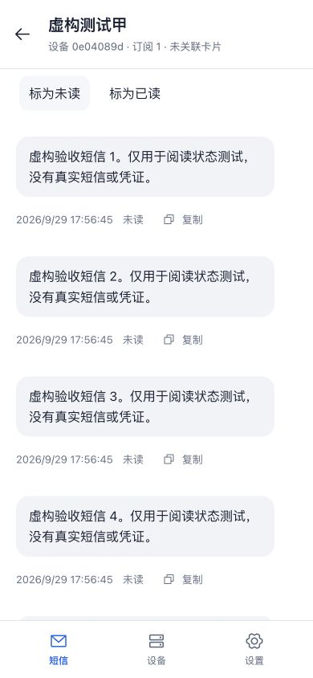
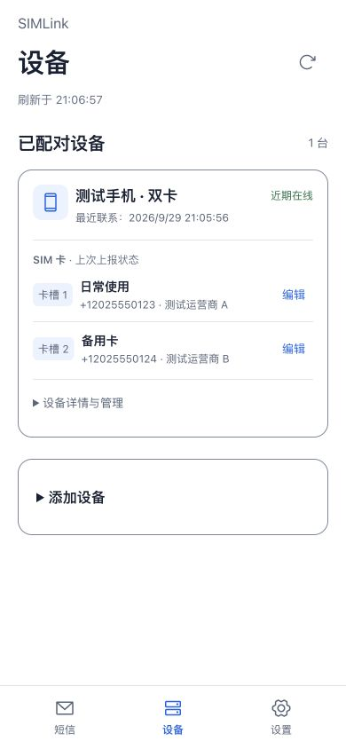

# SIMLink

自托管的远程 SIM 短信工具。Android 手机接收和发送短信，单体服务存储与转发事件，Web/PWA 提供日常访问。

**当前为 Alpha。** 核心收件已有单台真机验证；真实远程发件、手机 Web Push 和长期后台运行仍有待验收项目。不要将它作为唯一的短信接收或紧急通信方式。

## 已实现

- Android 新短信持久化、断网补传和幂等同步；按设备和 SIM 区分来源。
- Web/PWA 收件列表、正文复制、SIM 筛选、已读/未读及跨浏览器同步。
- 持久登录、近期视图缓存、安装与更新入口。
- 指定 SIM 远程发件，排队一小时，未领取超时取消；结果未知不自动重发。
- Web Push 新短信提醒：默认关闭，主动授权；显示发件人，不显示正文。
- 配对、设备撤销、SIM 名称与电话号码备注。

不包含 MMS/RCS、通话音频、原生 iOS 客户端、多租户或验证码提取。Telegram、设备失联提醒尚未实现。

## 界面

以下截图使用虚构短信、测试号码与测试设备；它们展示界面，不代表真实双卡或蜂窝链路验收。

 

## 快速部署

需要 Docker Engine 与 Compose v2、一个 HTTPS 域名，以及现有反向代理或 Tunnel。后端和 Web 使用同一容器、同一域名，数据存于 SQLite 持久卷。

在仓库根目录：

```sh
cd services/api
cp .env.example .env
# 编辑 .env，将 PUBLIC_ORIGIN 改为自己的 HTTPS Origin，不带末尾斜杠。
docker compose up -d --build --wait
```

将域名转发至服务器的 `127.0.0.1:8787`。默认端口仅绑定回环；若代理位于另一个容器，需使用正确的容器网络，不能将代理容器的 localhost 当成宿主机。

初始化唯一管理员，以下命令使用 Bash，密码至少 12 字符：

```bash
read -r -s -p '管理员密码: ' simlink_password
printf '\n'
printf '%s' "$simlink_password" | docker compose exec -T api node src/admin.mjs
unset simlink_password
```

打开自己的 HTTPS 地址登录，然后进入「设备」创建一次性配对凭证。没有默认密码或公开注册。详细配置、macOS 输入方式、小内存服务器部署和备份见 [后端说明](services/api/README.md)。

## Android 安装与配对

要求 Android 14+。当前尚未提供正式签名的发行 APK；请按 [Android 构建说明](apps/android/README.md) 本地构建并安装 Debug APK，或按 [发布说明](docs/RELEASING.md) 配置自己的 Release 签名。

1. 打开 Android 应用的服务器连接入口，扫描或输入 Web 生成的配对凭证，核对域名后确认。
2. 按需授予接收短信与读取 SIM 权限，使用一条新收到的测试短信验证同步。
3. 远程发送默认关闭，需在 Android 主动启用并授予发送权限。
4. iPhone 可从 Safari 将站点添加到主屏幕。PWA 更新完成后，在「设置 → 此设备通知」主动开启并测试通知。

配对前的短信不自动导入。更换服务器、恢复绑定和旧队列处理见 [设备身份](docs/DEVICE-IDENTITY.md)。

## 可靠性与隐私边界

- 后台处理受 Android 和厂商省电策略影响，不保证即时发送或永久在线；个别机型可能要求系统发送确认。
- “已发送”指系统发送回调成功，不代表对端已送达；未知或部分发送不会自动整条重试。
- 真实远程发送、手机 Push 显示和长时间锁屏待机仍待专项验证，详见 [当前计划](docs/PLAN.md)。
- 服务端短信为明文 SQLite；浏览器会缓存近期视图，退出/401 清理。推送显示发件人，可能出现在锁屏。
- 备份包含凭证相关数据和推送私钥，需保护并在升级前创建备份；`docker compose down -v` 会删除数据。
- 当前没有短信自动保留期清理和管理员密码恢复命令。忘记密码时不要删除数据库来“重置”。

详见 [数据与隐私](docs/PRIVACY.md)、[安全策略](SECURITY.md)、[PWA](docs/PWA.md) 和 [Web Push](docs/WEB-PUSH.md)。

## 开发与贡献

- [API / Docker](services/api/README.md)：Node.js、Fastify、SQLite。
- [Web/PWA](apps/web/README.md)：React、TypeScript、Vite。
- [Android](apps/android/README.md)：Kotlin、原生 View、平台短信 API。
- [架构](docs/ARCHITECTURE.md)、[API 契约](docs/API-V1.md)、[产品行为](docs/UX.md)。

开发流程见 [CONTRIBUTING.md](CONTRIBUTING.md)，版本记录见 [CHANGELOG.md](CHANGELOG.md)。仓库配置了 CI；尚未在远程平台实际运行的工作流不能视为已通过。

## 许可证

项目采用 [MIT](LICENSE)。第三方组件保留各自许可证，来源说明见 [THIRD_PARTY_NOTICES.md](THIRD_PARTY_NOTICES.md)。
